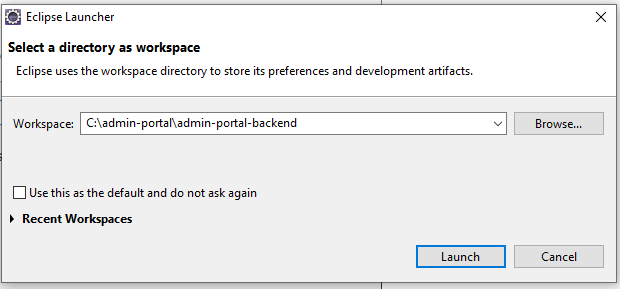
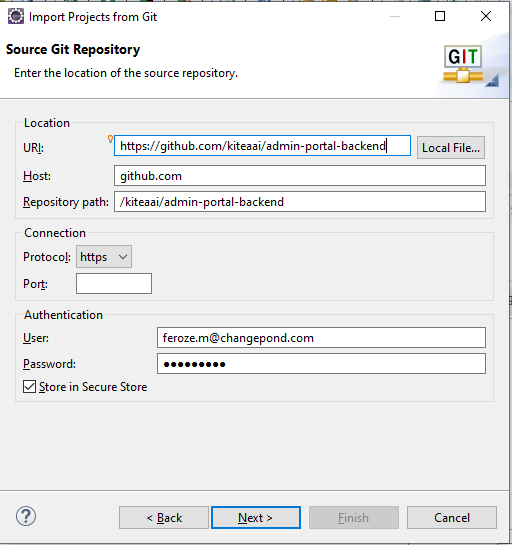
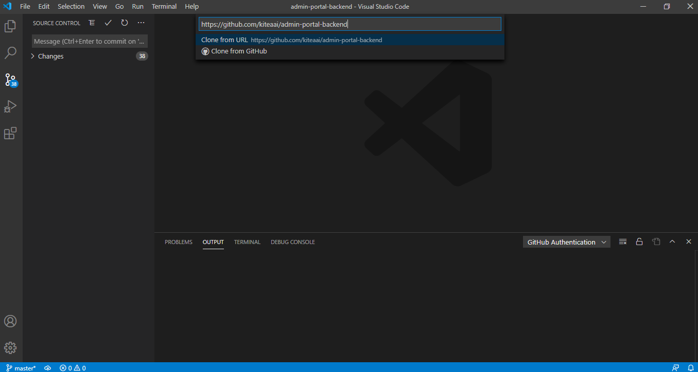
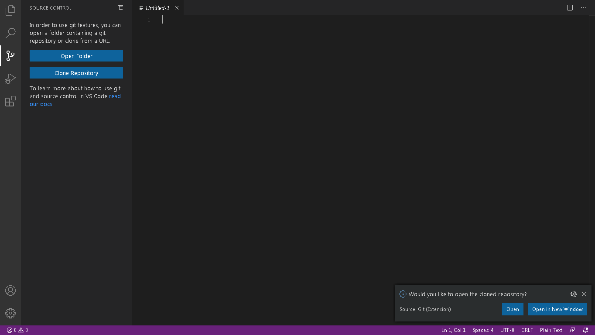
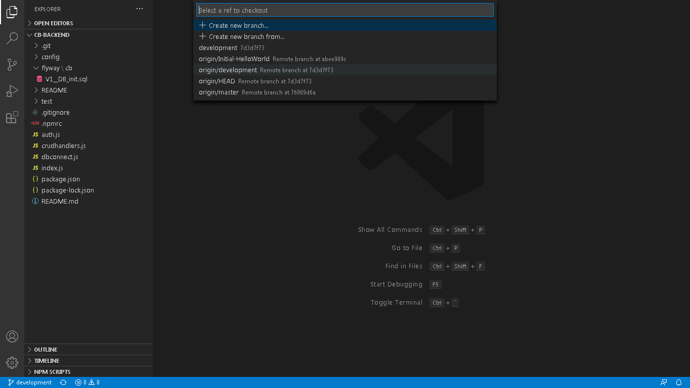

**1.	Introduction**

This document has a step by step approach for setting up the required software also the code which should be running it in the local environment by using Eclipse or VSCode.

**2.	Installing sotware and configuring environment variable**

*2.1.	Installing NodeJS and NPM*

Install nodejs and npm from

	https://nodejs.org/en/download/
	
Download Windows Installer (.msi) 64bit.

NodeJS version 14.3.0 and NPM version 6.14.5 were used for the initial setup of the project.

**3.	Installing the  IDE and pulling code from Git**

The developer can choose and use anyone of the below IDE to set up the local environment.
1. Eclipse
1. VSCode

**3.1.	Code Setup using Eclipse**

*3.1.1.	Installing Eclipse* 

We can use any version of Eclipse. Download Eclipse from

	http://www.eclipse.org/downloads/
	
Choose a mirror close to you and download from there and install it.

	eclipse-inst-win64.exe  

*3.1.2.	Pulling Projects from GITHUB* (Very similar steps as cb-frontend except the last one)

To get the Content Builder back end project

1.	Start Eclipse and create a workspace file in your preferred local directory (ex. C:\admin-portal\admin-portal-backend) 

2.	 Open the Git perspective.
From Eclipse open Window -> Perspective -> Open Perspective -> Other.. -> Git
3.	In the Git - Select Repositories source.
Click on "Clone a Git Repository" 
4.	Select Clone URI for import from Github.
5.	In the Source Git Repository, copy paste URI https://github.com/kiteaai/admin-portal-backend .
6.	Provide your Github user and password if it is not there by default and click Next 
7.	Once the project branch appears in the Git Repositories window, choose the required branch (ex. development) and click next.  
8.	Provide a local Destination directory for checkout (ex. C:\admin-portal\admin-portal-backend-source) and click Finish 
9.	Open a command prompt window and navigate to  the source directory (ex. C:\admin-portal\admin-portal-backend-source)
10.	Execute the following commands to install

npm install 

 
**3.2.  Code Setup using VSCode**

3.2.1.    Installing Visual Studio Code 

We can use any version of Visual Studio Code. Download and Install Visual Studio Code from

	https://code.visualstudio.com/Download
 
3.2.2.    Installing Git

Download and Install Git from

	https://git-scm.com/downloads
 
3.2.3.    Installing Git plugin in VSCode

1.  Open VSCode.
1.	To Install the Git plugin for VSCode. From VSCode open View-> Extensions-> Type Git in search  -> Install GitHub.  

*3.2.4.    Pulling Projects from GITHUB* 

To get the Content Builder Back end project

1.  Open VSCode.
1.	Open the Git perspective. From VSCode open View-> SCM 
1.	In the Git - Click on Clone Repository.

1.	In the Provide Git Repository URI , copy paste URI https://github.com/kiteaai/admin-portal-backend.
1.	Provide your Github user and password if it is not there by default and click Enter.
1.	If the Authorize GitHub for VSCode appears in the Browser Click Authorize github and confirm password.
1.	Provide a local Destination directory for checkout (ex. C:\admin-portal\admin-portal-backend) and click Finish.
1.	Open Cloned Repository by clicking the Open button in the dialog box.

1.	To Switch the required branch (ex. development) click the bottom-left corner existing branch name and select from the drop down.

To Open a command prompt window. From VSCode open Terminal -> New Terminal.

1.	Execute the following commands to install

npm install 

